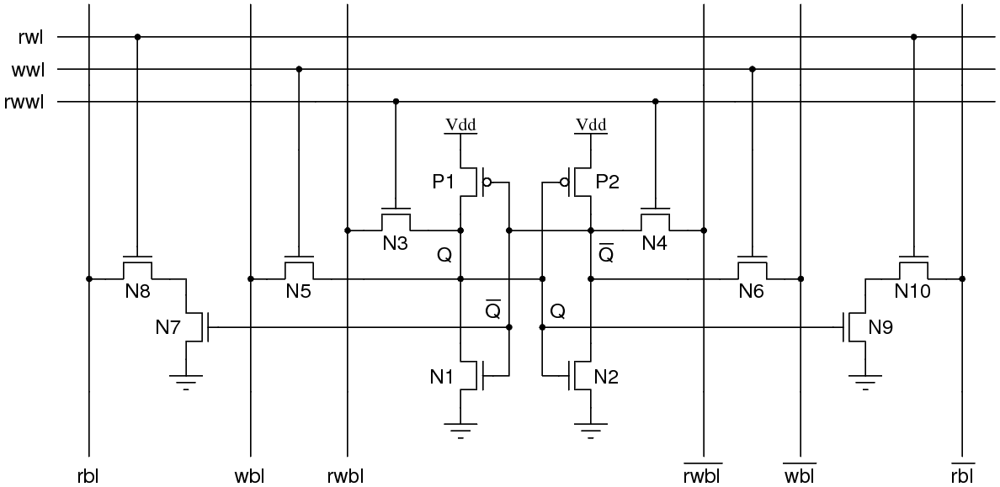

### [Go Back](./index.md#directory)

# Library Cells
This page of the documentation explains the library cells of OpenRAM.

## Table of Contents
1. [Required Hard/Custom Cells](#required-hardcustom-cells)
2. [Bitcell(s)](#bitcells)
3. [Multiport Bitcells](#multiport-bitcells)
4. [Parameterized Bitcell](#parameterized-bitcell)
5. [Sense Amplifier](#sense-amplifier)
6. [DFF](#dff)
7. [Tristate/Write Driver](#tristatewrite-driver)

## Required Hard/Custom Cells
* Located in 
    * `$OPENRAM_TECH/<tech>/gds_lib`
    * `$OPENRAM_TECH/<tech>/sp_lib`
* A few library cells with layout and SPICE:
    * Bitcell (and dummy and replica bitcell)
    * Sense amplifier
    * DFF (from a standard cell library)
    * (Removing soon: write driver, tristate)
* P&R border layer defined for placement
* Sense amplifier pitch matched width to bitcell

## Bitcell(s)
* Python code is in `$OPENRAM_HOME/bitcells`
    * Layout in `$OPENRAM_TECH/<tech>/gds_lib `
    * SPICE in `$OPENRAM_TECH/<tech>/sp_lib`
* Can be a foundry bitcell if you have the GDS and SPICE.
* May include multiple port configurations:
    * `bitcell.py` uses `cell_6t.{gds,sp}` - standard 1rw port
    * `bitcell_1w_1r.py` uses `cell_1w_1r.{gds,sp}` for 1w and 1r port
    * `bitcell_1rw_1r.py` uses `cell_1rw_1r.{gds,sp}` for 1rw and 1r port
* Wish list: pin names are fixed right now as `bl`, `br`, `wl`, `vdd`, `gnd`

## Multiport Bitcells
* Based on 6T SRAM cell
    * Standard read-write
    * Isolated read-only ports
    * Write-only port (not sized for reads)
* Can accommodate foundry bitcells

## Parameterized Bitcell
* If a custom bitcell is not available, we create one with user design rules.
    * Not good for area, but may still be better than DFFs.
    * Can be useful for simulation/functional work before custom bitcell is available.
    * Example 1 RW pbitcell compared to custom 1RW

## Sense Amplifier
* Needs a sense amplifier that is pitch matched to the bitcell.
    * `$OPENRAM_TECH/gds_lib/sense_amp.gds`
    * `$OPENRAM_TECH/sp_lib/sense_amp.sp`
    * `$OPENRAM_HOME/modules/sense_amp.py`
* Wish list: pin names are fixed right now as `bl`, `br`, `dout`, `en`, `vdd`, `gnd`

## DFF
* Needs a standard cell DFF for the address and data registers.
    * `$OPENRAM_TECH/gds_lib/dff.gds `
    * `$OPENRAM_TECH/sp_lib/dff.sp`
    * `$OPENRAM_HOME/modules/dff.py`
* Have auxiliary code to create:
    * Buffered DFFs (`dff_buf.py`) using dynamically generated inverters (pinv)
    * Inverted output DFFs (`dff_inv.py`) using a dynamically generated inverters (pinv)
    * 2-D DFF arrays
        * Regular DFF arrays (`dff_array.py`)
        * Buffered DFF arrays (`dff_buf_array.py`)
        * Inverted DFF array (`dff_inv_array.py`)
* Wish list: pin names are fixed right now as `D`, `Q`, `Qb`, `clk`, `vdd`, `gnd`

## Tristate/Write Driver
* Tristate is used for multi-bank implementations
* Write driver drives the data onto the bitlines
* Both of these are currently library cells, but plans are to make them dynamically generated (`ptristate.py` and `pwrite_driver.py`)