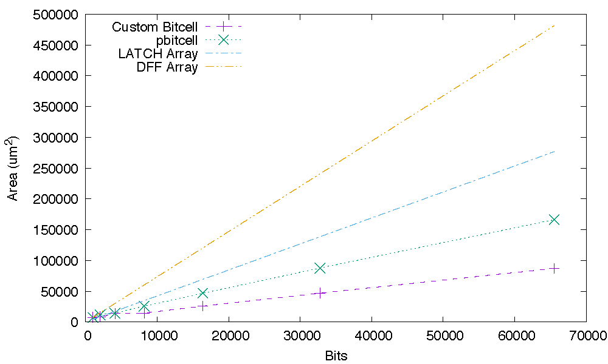
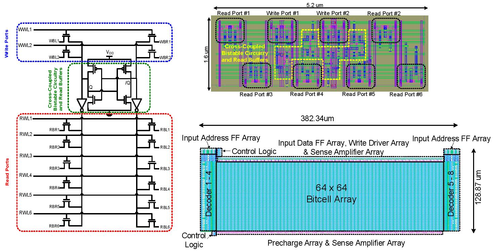
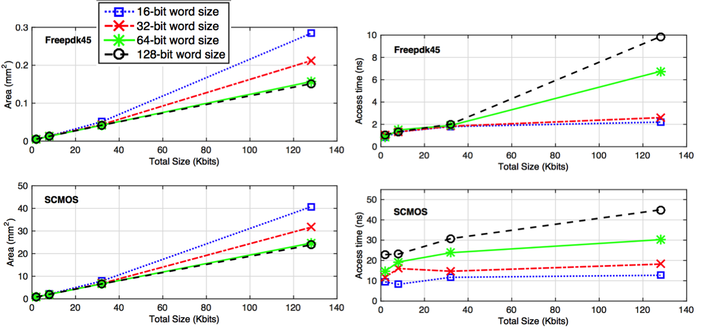

### [Go Back](./index.md#directory)

# Results
This page of the documentation explains the results of OpenRAM.

## Table of Contents
1.  [Small Layouts](#small-layouts)
2.  [Relative Planar Bitcells](#relative-planar-bitcells-035um-scmos)
3.  [SRAM Area](#sram-area)
4.  [Generated Layout by OpenRAM](#generated-layout-by-openram-for-a-multiport-6r2w-sram-in-32-nm-soi-cmos-technology)
5.  [Timing and Density Results for Generated SRAMs](#timing-and-density-results-for-generated-srams)
6.  [Comparison with Fabricated SRAMs](#comparison-with-fabricated-srams)
7.  [Conclusions](#conclusions)

## Small Layouts
|  |  |
| :----------------------------------------------------------: | :----------------------------------------------------------: |
| 512 x 16b x 1rw FreePDK45                                    | 2048 x 32b x 1rw FreePDK45                                   |

## Relative Planar Bitcells (0.35um SCMOS)
|  |  |    |
| :-----------------------------------------------: | :------------------------------------------------: | :--------------------------------------------------: |
| Standard 6T (1rw) 6.8um x 9.2um                   | Isolated Read 10T (1rw, 1r) 10.9um x 13.9um        | DFF 21.9um x 21.2um (from OSU standard cell library) |

## SRAM Area

## Generated Layout by OpenRAM for a multiport (6R/2W) SRAM in 32 nm SOI CMOS Technology

## Timing and Density Results for Generated SRAMs

## Comparison with Fabricated SRAMs
| $\textrm{Reference}$    | $\textrm{Feature Size}$ | $\textrm{Technology}$ | $\textrm{Density } (Mb/mm^2)$ |
| :---------------------- | :---------------------: | :-------------------: | :---------------------------: |
| $\textrm{IEEE-VLSI'08}$ | $65 nm$                 | $\textrm{CMOS}$       | $0.7700$                      |
| $\textrm{JSSC'11}$      | $45 nm$                 | $\textrm{CMOS}$       | $0.3300$                      |
| $\textrm{JSSC'13}$      | $40 nm$                 | $\textrm{CMOS}$       | $0.9400$                      |
| $\textrm{OpenRAM}$      | $45 nm$                 | $\textrm{FreePDK45}$  | $0.8260$                      |
| $\textrm{JSSC'92}$      | $0.5 \mu m$             | $\textrm{CMOS}$       | $0.0036$                      |
| $\textrm{JSSC'94}$      | $0.5 \mu m$             | $\textrm{BICMOS}$     | $0.0020$                      |
| $\textrm{JSSC'99}$      | $0.5 \mu m$             | $\textrm{CMOS}$       | $0.0050$                      |
| $\textrm{OpenRAM}$      | $0.5 \mu m$             | $\textrm{SCMOS}$      | $0.0050$                      |

## Conclusions
* The main motivation behind OpenRAM is to promote and simplify memory-related research in academia and provides a platform to implement and test new memory designs. 
* OpenRAM is open-sourced, flexible, and portable and can be adapted to various technologies.
* OpenRAM generates the circuit, functional model, and layout of variable-sized SRAMs.
* OpenRAM provides a memory characterizer for synthesis timing/power models. 
* We are also actively introducing new features, such as non-6T memories, variability characterization, word-line segmenting, characterization speed-up, etc.